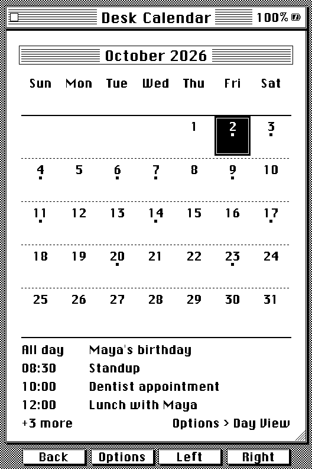
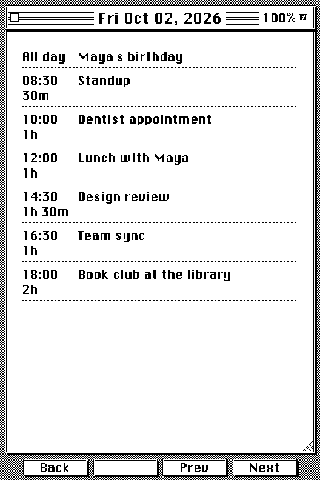
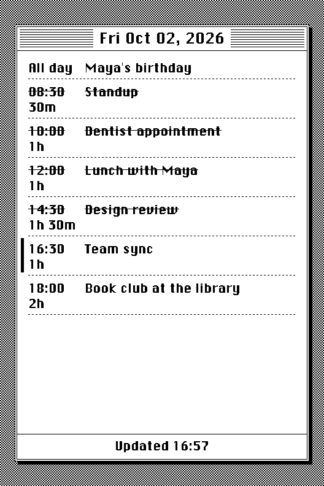
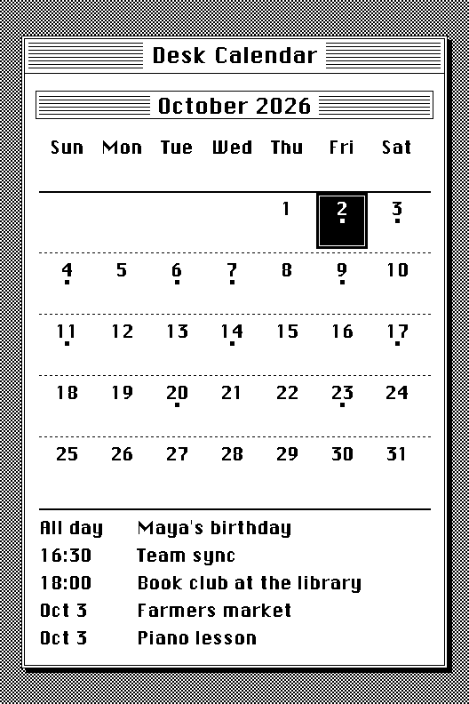

# Calendar Sync

Calendar Sync puts your Google, Apple (iCloud) or Outlook calendar on the reader. Events show up in the Desk Calendar, in a full-screen Day View, and on two sleep screens. You give the reader your calendar's iCal link once, then update it whenever you like. The reader only ever reads the calendar; it never changes it.

  

  

  

The events are saved on the SD card (`/.crosspoint/calendar.bin`), so they survive restarts and the reader works offline between syncs. Only a few kilobytes of the reader's own flash are used for the feature itself; the data lives on the card.

## Set it up

1. Get your calendar's iCal link (below).
2. On the reader, open **File Transfer** and start a web server (Join a Network). Open the address it shows in a browser, go to **Settings**, and find the **Desk Calendar** card.
3. Paste the link, press **Save**, then **Sync Now**.

After that, you can update from the reader alone: open **Desk Accessories > Desk Calendar**, press the middle button (**Options**), and choose **Sync Calendar**. The reader restarts into a clean network boot (a secure connection needs a lot of free memory), connects to Wi-Fi, downloads the calendar, shows the progress, and returns to Home.

If you run it before adding a link, the reader tells you to add one on the File Transfer page.

## Getting the link

- **Google Calendar**: on a computer, open Settings, choose the calendar, then Integrate calendar, and copy **Secret address in iCal format**.
- **Apple Calendar (iCloud)**: in the Calendar app, share the calendar and turn on **Public Calendar**, then copy the link. It starts with `webcal://`, which works as is.
- **Outlook / Microsoft 365**: in Outlook on the web, open Settings, Calendar, Shared calendars, **Publish a calendar**, pick the calendar with "Can view all details", and copy the **ICS** link.

Anyone with the link can read the calendar, so keep it private. The reader stores it obfuscated on the SD card and never shows it again after you save it. To replace it, paste a new one; to remove it, use **Remove Link** on the same card.

## Desk Calendar

  

- A small square sits under every day that has an event.
- The front **Left** and **Right** buttons move one day at a time, rolling into the next or previous month. The side page-turn buttons change the month. On a touch reader you can also tap a day.
- The **filled black** day is the one you are looking at. **Today** has a double border around its number; when they are the same day you get a filled day with a ring inside. Today is known on a reader with a clock, or from the date you picked on the original X4.
- The selected day's events are listed under the grid. If there are more than fit, the list ends with "+N more" and a reminder to use **Options > Day View**.
- **Options** holds **Sync Calendar** and **Day View**, plus **Set Date** on the original X4.

## Day View

**Options > Day View** shows the selected day full screen: every event on its own row, the start time on the left with how long it lasts under it ("45m", "1h 30m"), and the whole title beside it, up to four lines. **Left** and **Right** go to the previous and next day, the side buttons scroll a long day, a touch reader can swipe (up and down to scroll, left and right to change day), and **Back** returns to the month, which follows the day you ended on.

## Events that cross midnight

An event that runs past midnight shows on every day it covers (up to 31 days): **Continues** under the start time on its first day, **Ongoing** on days in between, and **Until** with the end time on its last. An event that ends exactly at midnight stays on one day.

## Sleep screens

  

  

Both are under **Settings > Sleep Screen**.

- **Desk Calendar** is the month with the event squares plus a list of what is still to come: today's remaining events with their times, then later days by date. With a clock, today's finished events are left out.
- **Calendar Day** shows the whole of today in the Desk Calendar's window: each event with its start time, length and title. With a clock, events that have finished are struck through, the one under way has a bar beside it and a bold title, and the bottom line says when the screen was last drawn ("Updated 2:14 PM"). An event with no end time counts as an hour long, and all-day events are never struck through. If the day has more events than fit, it starts at the first unfinished one and ends with "+N more".

On the original X4, which has no clock, both show the day you set in **Options > Set Date**. Nothing is struck through on Calendar Day and there is no update time, since the reader cannot tell what time it is.

## What it understands

- Single events, all-day events, multi-day events, and events that cross midnight.
- Repeating events: daily, weekly, monthly and yearly, with days of the week, "the second Thursday", "the last day of the month" and "the last weekday", intervals, end dates, counts, and skipped dates.
- Single occurrences that were moved or cancelled.
- About 45 days back and 13 months ahead are kept, up to 600 entries. If a very busy calendar goes over that, the sync tells you some events were left out.

## Limits

- Times ending in `Z` (UTC) are shifted by the time zone set on the reader (Settings > Clock). Times that name another time zone are taken as already being local, which is right for a calendar kept in your own time zone and off by the difference for an event set in another.
- One calendar at a time. It is read-only; you cannot add events from the reader.
- On the original X4 (no clock), set the date first (**Options > Set Date**) so the reader knows what "today" is, and set it again now and then, since it cannot keep time on its own.
- Event titles use the reader's UI font, so a title in a script that font lacks may show gaps.

## If a sync fails

The reader shows what went wrong, and for a connection problem a second line with the reason. The most common ones:

- **"No calendar link set up yet"**: add the link on the File Transfer page first.
- **"That link isn't a calendar"**: the address worked but returned a web page, not a calendar. Check that you copied the iCal (.ics) address.
- **"Set the date first (Options)"**: the original X4 needs a date picked first.
- **"Couldn't reach the calendar"**: the connection failed. Check your Wi-Fi and the link; the line under it gives the technical reason if you need to report it.
