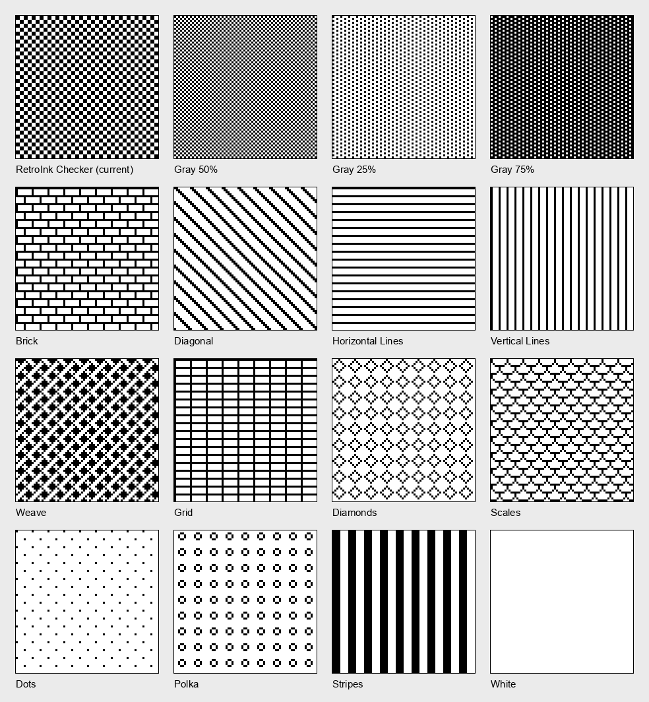
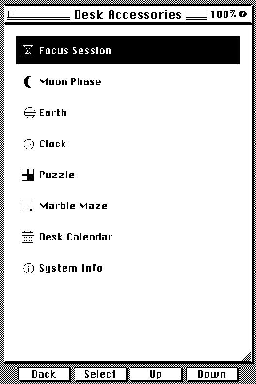
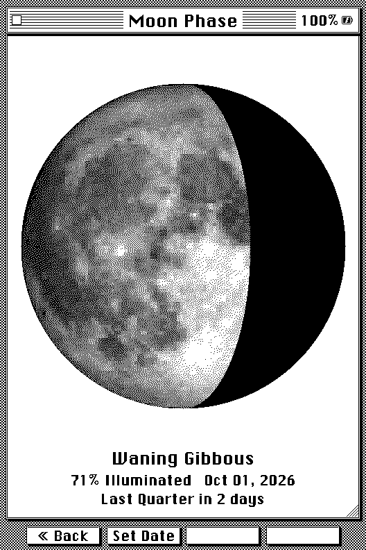
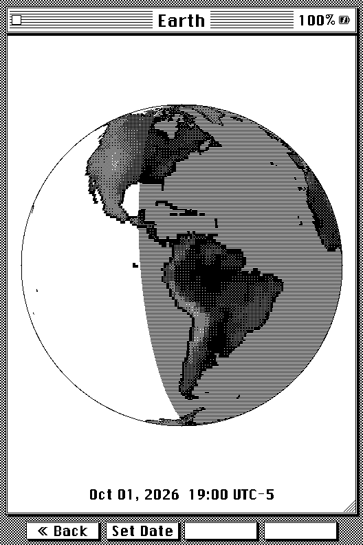
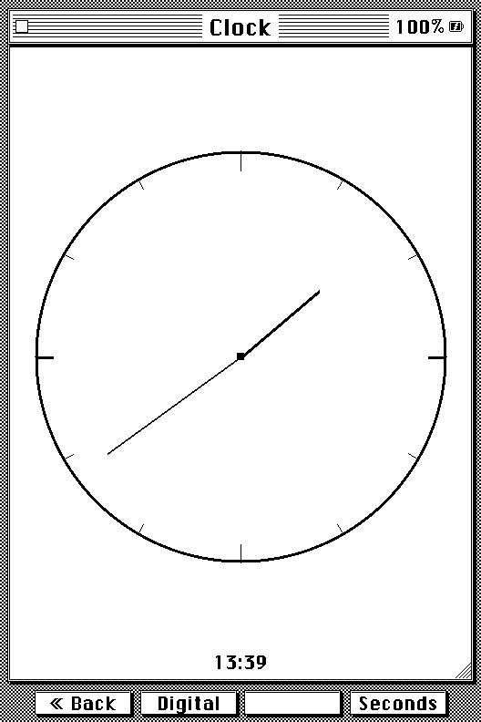
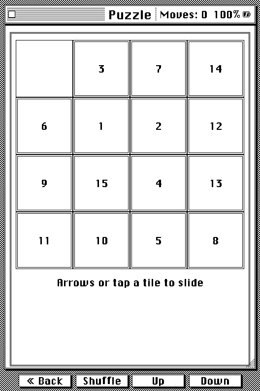
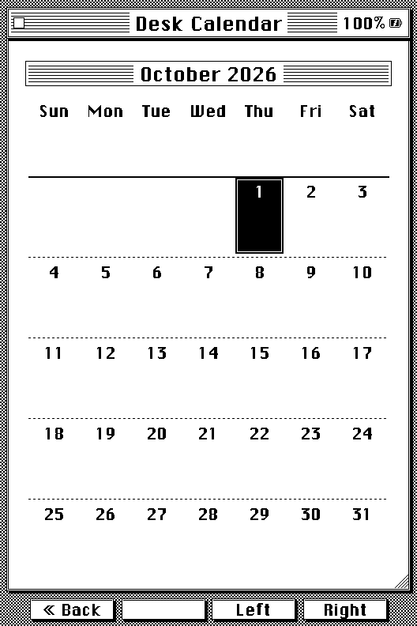
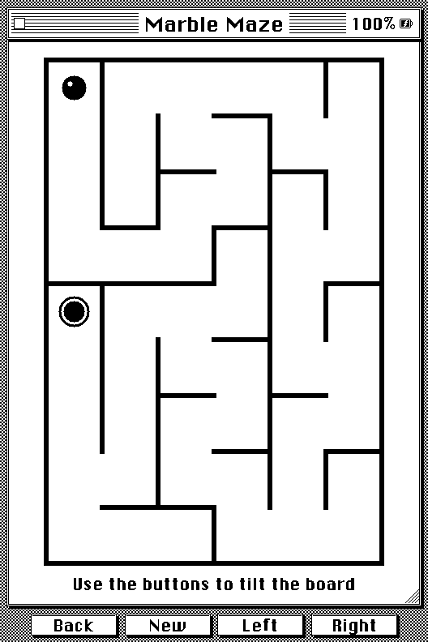

# What's Different in RetroInk

Everything you love about [CrossInk](https://github.com/uxjulia/CrossInk), its reading engine, library, transfer, dictionary, and synchronization features, now with a full System 6 retro redesign, a reimagined stats dashboard, a real library, classic Mac desk accessories, Focus Session reading goals, Obsidian clip syncing, and calendar syncing. This page covers that RetroInk-specific delta. For the full feature set RetroInk inherits from CrossInk, see the dropdown near the bottom of this page.

> **On an original X4?** It has no clock chip. Moon Phase, Earth, and Desk
> Calendar ask you to pick a date instead, and the Clock accessory, the
> reading-stats sleep screens, and daily reading goals are left out. A few
> other things differ slightly too. See [X3 vs X4](./installation.md#x3-vs-x4)
> for the full list and why. The X4 Pro and X4 Classic aren't supported
> yet.

## Retro UI

A full System 6 theme, not a palette swap: striped title bars, square controls, inverted-selection lists, and a checkerboard desktop texture cover every window, menu, dialog, and progress bar. The boot sequence is a small pixel-drawn Macintosh whose eyes shift left, right, then center across three redraws, and the default sleep screen is that same Mac, asleep, with "RetroInk is resting between chapters."

Change the texture behind every window under **Settings > Display > Desktop Pattern**. There are sixteen classic Macintosh 8×8 patterns, from the original checker to Brick, Weave, Diagonal, Diamonds, and a plain white desktop. The choice also carries onto the boot and sleep screens.

The theme costs no extra memory. Windows, icons, the hourglass, and drop-shadowed keycaps are all drawn in code, straight onto the single 1-bit screen buffer, so there is no second buffer, no stored images, and no animation frames. You can switch themes under **Settings > Display > UI Theme**.

Pick your sleep screen in **Settings > Display > Sleep Screen > Wallpaper**. It opens a picker with a preview of each screen, drawn with your own book, stats and date: Left and Right browse, Select uses the one you are looking at. They run in this order: the original CrossInk options, then RetroInk's own, then the desk accessories. Alongside CrossInk's cover, custom image, and page overlay options, RetroInk adds the reading-stats screens (Today, Book Status, Book + Week Stats with the book's cover and your week, and Reading Year), the desk-accessory screens (Moon Phase, Earth, Desk Calendar, and Calendar Day), and three playful Mac-style dialogs:

  

  

  

The same Sleep Screen menu has **Fast Custom Sleep Images**, which draws your own sleep images in plain black and white instead of the slower multi-pass grayscale, and **Settings > Display > Reduce Screen Ghosting** clears more of the previous screen when you return Home, at the cost of a slightly longer transition. The reader's status bar text, including its clock, comes in Small, Medium, or Large under **Settings > Reader > Customize Status Bar > Text Size**.

## Home

Home lists **Library, Reading Stats, Desk Accessories, Clippings, File Transfer, and Settings**, plus **OPDS Browser** once you've added an OPDS server. The card for the book you're reading shows its cover, title, and a progress bar with the percentage read, and **Show Stats on Home** (in **Settings > System > Reading Stats**) adds your reading numbers to the screen.

## Stats Dashboard

  

  

Reading stats get a dedicated set of themed pages when the System 6 theme is active:

- **Today**, a reading-goal progress bar, a 7-day strip showing which days you hit your goal, and your current streak.
- **Reading Year**, a full year-long grid, one cell per day, in the same style as a GitHub contribution calendar, rendered as Mac icon tiles.
- **Book Status**, per-book progress, total time read, pages turned, and estimated time remaining.

Press Select on any of them to open the **Reading Desk**, where you can start a Focus Session or change your daily goal.

## Reading Goal

Reading goals are new in RetroInk, and they're what the Today and streak views above track. Set one in **Settings > System > Reading Stats > Daily Reading Goal** (5 to 180 minutes), then turn on **Reader Goal Countdown** on the same screen. Once it's on, a small badge in the top-right corner of the reading screen counts down your remaining minutes for the day, no need to leave the book or open the stats screen to check.

## Real Library

A proper library, not a flat file list: shelves for **To Read, Reading, Finished, and Favorites**, four sort modes (Title, Filename, Author, Recent), and an A-Z jump list. It's backed by an SD-side catalog, not an in-RAM list, built to hold thousands of books on the X3/X4's limited memory, and it scans your folders incrementally instead of blocking on a full rescan. Move or rename a book on the SD card yourself, and RetroInk reconciles the catalog entry instead of treating it as a new, unread book. A first scan asks before it starts and shows roughly how long it'll take.

Press Select for **Actions**: pin a book to Favorites, move it to another folder, switch shelves, change the sort, jump A-Z, refresh the library after changing files elsewhere, or switch to **Icons** view, a Finder-style grid of document icons with titles underneath, and back to the shelf. The view can also be set with **Library View** in **Settings > System > Files & Cache**, or in web settings.

## Custom Shelves

Beyond the built-in To Read/Reading/Finished/Favorites categories, you can create your own named shelves and sort books into them however you like, a reading queue for a book club, a "borrowed" shelf, whatever makes sense for your library. Create and manage them from the web file transfer portal's new **Library** tab, drag and drop books between shelves (works with touch too), or from the device itself.

On the device, Library browsing is a redesign from the ground up: books are drawn as spines standing on a shelf, and the front buttons map the way you'd actually browse a physical shelf. Left and Right page through the books on the current shelf; Up and Down switch straight to the next or previous shelf, built in or custom, no menu in the way. Pull up Actions and set whichever shelf you're looking at as the one Library opens to by default.

## Desk Accessories

Classic Macs had a menu of small utilities, the desk accessories. RetroInk has its own under **Desk Accessories** on Home:

  

  

  

- **Focus Session**, the reading timer below.
- **Moon Phase**, today's moon drawn from a real photograph, with its phase name, how much is lit, and how long until the next phase ("Full Moon in 3 days").
- **Earth**, a day/night globe centred on your time zone, with the date, time, and zone it's showing.
- **Clock**, an analog or digital desk clock with an optional seconds display. It keeps the reader awake while it's open, so it can sit on a desk.
- **Puzzle**, the classic fifteen-tile slider. Your board and move count are saved after every move.
- **Marble Maze** (X3 only), a tabletop tilt maze. Tilt the reader to roll the ball into the hole; a new random maze every game. The far-right button opens Options: **Recalibrate** (lay the reader flat on a table to set level), and **Invert Left/Right** and **Invert Forward/Back** if a tilt rolls the wrong way for how you hold it.
- **Desk Calendar**, a month view with today marked. With [Calendar Sync](./calendar-sync.html) it also shows your own calendar: event squares, the selected day's events, and a full-screen Day View.
- **System Info**, firmware version, storage use, and battery level.

  

  

  

  

Press **Set Date** on Moon Phase or Earth to look at any other date; Earth also takes a time and a time zone. In the picker, the side buttons move between fields and the front buttons change the value (hold to scroll). Moon Phase, Earth, and Desk Calendar are also available as sleep screens, and Calendar Sync adds a Calendar Day screen.

### How I built the Marble Maze

The maze is carved fresh every game with a depth-first "recursive backtracker", which makes long winding corridors with exactly one route between any two cells, and a breadth-first search over it puts the hole in the cell farthest from the start. The ball is simple physics: tilt becomes acceleration, friction bleeds off speed, and each move is split into sub-pixel steps and checked against the walls one axis at a time, so it slides along a wall instead of sticking to it or tunnelling through. On the X3 the tilt comes from the accelerometer, re-levelled to whatever angle you're holding when the maze appears. The hard part was e-ink: it can't animate, so each frame repaints only a small window around the ball, and the X3's panel gets a half-length Fast waveform while the game is open to make those updates about twice as quick. A full-panel flash is saved for the moments you'd expect a pause anyway.

### How I built the Moon

The Moon starts from a public-domain NASA photograph of the full moon, which I crop to the disc, contrast-stretch, and store at 100×100 pixels and 4 bits per pixel, about 5 KB of flash. The phase itself is arithmetic: the time since a known new moon (6 January 2000), divided by the 29.53-day synodic month. The lit edge doesn't come from the photo at all. It's computed geometrically for each row from the phase angle, so craters and maria never bend the terminator. Every pixel is then sampled from the photo and dithered down to black and white with Floyd–Steinberg error diffusion, which only ever needs two rows of error buffer. The reader's chip has no floating-point unit, so a full-screen disc takes a few seconds to build. I build it once, cache it for the rest of the session, and show a "Calculating…" placeholder first so Back still works while it runs.

### How I built the Earth

The globe comes from NASA's public-domain GEBCO elevation data. A small Python script bakes it into two maps: a 384×192 one-bit land mask for crisp coastlines, and a coarser 192×96 elevation map at 4 bits per cell, about 18 KB together. On the device, each pixel of the disc is projected back to a latitude and longitude, an orthographic view centred on your time zone's longitude. The sun's position comes from the date and time: the day of the year sets its declination (Earth's 23.44° tilt), and the UTC hour sets which meridian is at noon. One cosine test per pixel then decides day or night. Land is shaded by elevation with a 4×4 ordered dither, so mountains come out lighter, and the night-side ocean gets horizontal hatching instead of a stipple, so the continents don't dissolve into the dark. To keep it quick without an FPU, the map column for each pixel is walked along each row rather than worked out with inverse trig, and the finished globe is cached for ten minutes.

### How I built the Clock

The digital face isn't a font. Each digit is drawn from a tiny 3×5 pixel pattern scaled up into solid blocks, and hours, minutes, and seconds each get their own little System 6 window with a pinstriped title. The analog face is plain line drawing: a rim, twelve ticks, and three hands placed from the time. The seconds were the hard part. E-ink can't redraw a whole screen every second, so each tick repaints only the clock's own region and pushes just that window to the panel as a partial refresh, rounded out to the 8-pixel boundaries the display controller needs. Fast partial refreshes slowly leave ghosting behind, so every five minutes the clock does one full refresh to wipe the panel clean. The repaint also runs on the render task, not the main loop: the buttons are polled, and a refresh blocks for about half a second, so ticking from the main loop was quietly swallowing button presses.

## Charging Screen

An optional System 6-styled screen that appears automatically when you plug in the charger and aren't actively reading, in place of whatever was on screen. Toggle it in **Settings > Display > Charging Screen**.

## Focus Session

A configurable reading-session timer, in **Desk Accessories > Focus Session**:

- Session length from 5 minutes to 24 hours: the front buttons step 5 minutes, the side buttons an hour.
- Choose how often the countdown redraws, every second, every minute, or every 5 minutes, to trade responsiveness for e-ink refreshes and battery. Seconds only show with the every-second option.
- The countdown is a grid of tiles, one per minute, that clear as time passes.
- Wi-Fi turns off and the reader stays awake for the session.
- The session saves its progress as it goes, so if the reader restarts or is put to sleep, it picks up with the right time remaining (on an X4, the timer pauses while it's asleep).
- You can also start a session from the **Reading Desk** in Reading Stats.

## Obsidian Clipping Sync

Pushes the highlights you save while reading straight into an Obsidian vault, over your local network via Adam Coddington's [Local REST API with MCP plugin](https://github.com/coddingtonbear/obsidian-local-rest-api), or to any webhook. On top of, not instead of, the existing `/My Clippings.txt` export. Highlights saved before you set it up, including ones carried over from CrossInk, can be sent too with **Queue Older Highlights**. See the [full guide](./obsidian-sync.html).

## Calendar Sync

Your Google, Apple (iCloud) or Outlook calendar, on the reader. Paste the calendar's iCal link once on the File Transfer web page, then update it any time from **Desk Calendar > Options > Sync Calendar**. Events appear in the Desk Calendar with a square under each busy day, a Day View shows a whole day with full titles and lengths, and two sleep screens show the month with what is coming up, or all of today with finished events struck through and a note of when it was last updated. Repeating events, all-day and overnight events, and moved or cancelled occurrences are handled. Everything is stored on the SD card. See the [full guide](./calendar-sync.html).

## Web Portal

The on-device web portal, what loads in your browser when you connect over Wi-Fi in File Transfer mode, gets the same System 6 treatment as the device: the checkerboard desktop texture, striped title bars, beveled buttons, and the same UI font the reader itself uses. Pages span the full width of your browser window instead of sitting in a fixed centered column, and the Library tab mirrors the device: Smart Shelves and Your Shelves as switchable tabs, with drag-and-drop between shelves.

## Updates over Wi-Fi

**Settings > System > Check for Updates** downloads new RetroInk releases straight to the reader and shows what's new before you install. See [Installation](./installation.html#update-over-wi-fi).

## What changed or was removed

RetroInk isn't purely additive. A few things from stock CrossInk work differently or aren't there anymore:

- **Recent Books** is no longer its own Home menu entry. Library's Recent sort covers the same ground, and the Home book panel still lets you jump back into whatever you were last reading.
- The **Files** shortcut is hidden from Home by default now that Library is the primary way to browse books. It's one setting away from coming back, with **Show Files on Home** in **Settings > System > Files & Cache**, or in web settings.
- **Focus Session** moved from Home into **Desk Accessories**.
- **UI Scale** is gone. RetroInk always uses the large interface size so its controls and labels stay readable.

## Everything CrossInk already does

RetroInk keeps all of this from CrossInk. Click to expand the full list.

- New reader fonts: Lexend Deca and Bitter.
- Miscellaneous symbol support; emoji show when you use a font from the SD card.
- Reader font sizes: 10 pt, 12 pt, 14 pt, and 16 pt.
- Strikethrough support, and thicker underlines for better visibility.
- A custom Minimal theme and sleep screen option.
- A custom Dashboard theme and sleep screen option.
- Support for `
` section breaks and "redaction" style rendering.
- Improved support for tables with simple markup.
- Bookmarks, and front-button remapping that only applies in the reader.
- Bionic Reading and Guide Dots as optional reader modes.
- Force Paragraph Indents, for books that render as one giant wall of text.
- Pin a sleep image as a favorite.
- Extra in-reader control remapping for side buttons, short power-button clicks, and long-press menu actions.
- Mark a book as finished from the in-book menu, and move finished books to a "Read" folder.
- An in-book menu to adjust reader options without leaving the book.
- Reading stats: total books read, total reading time, sessions, pages turned, average session time, pages turned per minute.
- All-time reading stats syncing between two CrossInk-family devices.
- Reading progress sync between two CrossInk-family devices.
- Customizable Auto Page Turn Interval (5 to 120 seconds).
- Safe book moves across the device, web file manager, and WebDAV, with reading-record recovery after a move made elsewhere.
- Nearby file transfer, OPDS browsing, dictionary lookups, and Calibre wireless transfers.
- Go to % and Go to Stable Page with a numeric keypad (hold Select to switch from the slider).
- Rename books from the File Browser without losing progress, bookmarks, or clippings.
- Custom boot screens from a BMP or a `/bootscreen` folder.
- Quick Lock, assignable button combinations, and selectable keyboard layouts.
- Separate top/bottom and left/right margins, and 0, 1, or 2 decimals for the status bar percentage.

## License

RetroInk is released under the same [MIT License](https://github.com/smashedllama/retroink/blob/main/LICENSE) as the CrossInk project it's forked from. RetroInk's own modifications are MIT-licensed too.

## Not affiliated

RetroInk is an independent community project. It is not affiliated with or endorsed by Apple, Xteink, or the CrossInk project.
